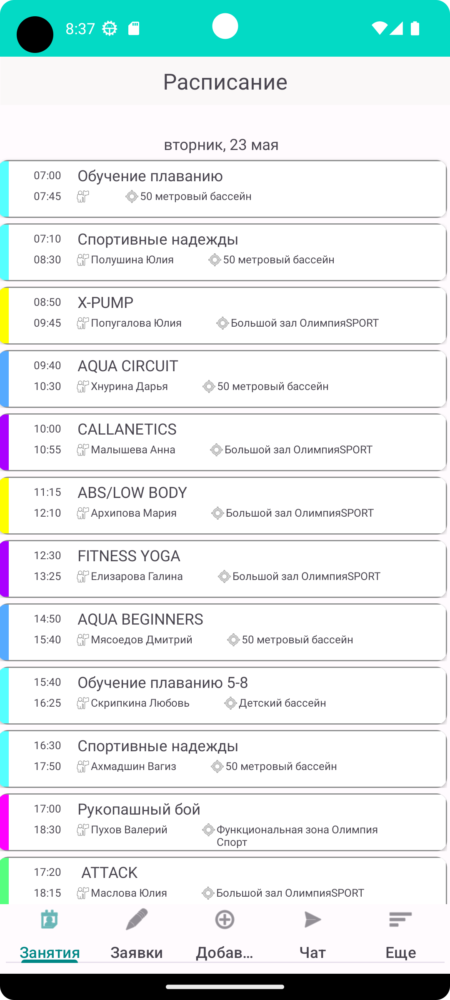
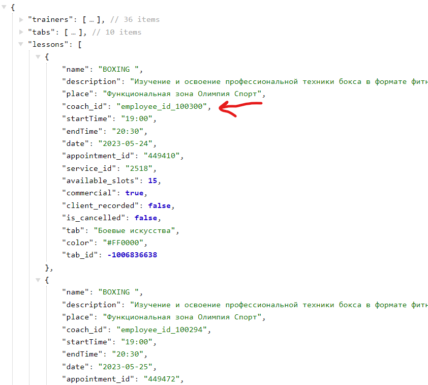
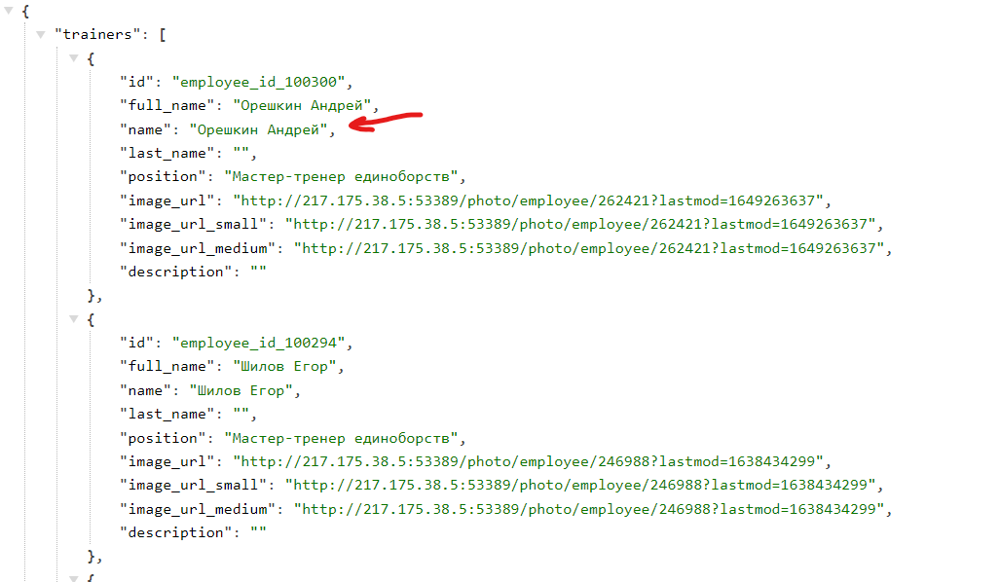

# Создание расписания для фитнес клуба:

Приложение отображает список занятий по дням недели. Уроки относящиеся к определенному 
дню недели отделены заголовком. Карточка занятия отображает информацию о: времени начала и 
конца урока, виде занятия, имени и фамилии тренера, месте проведения.

<code></code>

## Стек используемых технологий

<code></code>
<code></code>
<code></code>
<code></code>
<code></code>
<code></code>

## Использование Retrofit и MVVM

Сделал recyclerview, который отображает расписание занятий в фитнес-клубе.
Использовал билиотеку retrofit для работы с api. Для работы с данными и передачи их во view, 
я использовал LessonViewModel (архитектуру MVVM). 

## Использование RxJava

Чтобы подтянуть фамилию и имя тренера из списка преподавателей в каждую 
карточку занятия из списка уроков, я использовал библиотеку RxJava. Так как изначально в карте
урока нет имени и фамилии учителя, а только его id. Решил эту задачу так: после получения списков тренеров 
и занятий (с этим у нас отлично справился retrofit) я отправил их в поток computation, где дальше 
вытаскивал у каждой тренировки id преподавателя и с ним уже пробегался по списку тренеров. 
Если было совпадение, то вместо айди мы вставляем данные тренера. Плюс еще использовал BackpressureBuffer для
быстро отображения данных.

<code></code>
<code></code>

